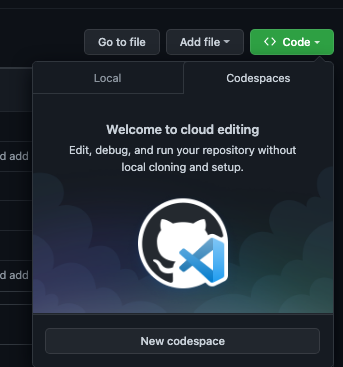
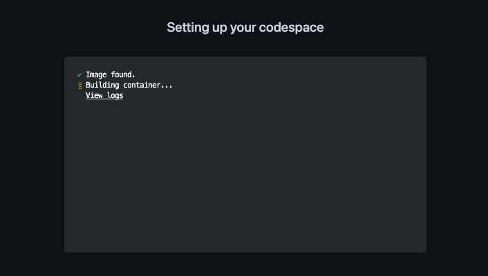
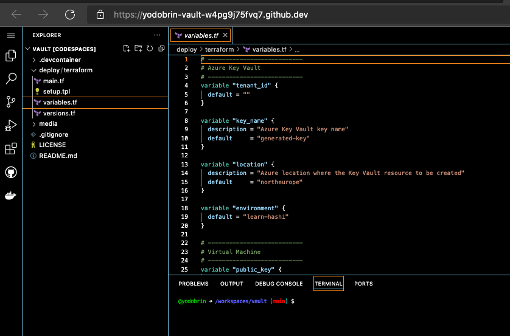
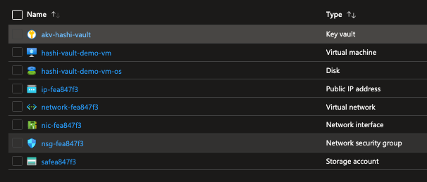

# Using Hashicorp Vault

## tl;dr

This terraform would spin up an Ubuntu VM with Hashicorp Vault as a service, configured to unseal with Azure keyVault.
> You can also do it directly from your favorite browser using [GitHub Codespaces](https://github.com/features/codespaces)

## Use case

As an ISVs using Vault for their secret storage, avoiding services which are not available across multiple clouds and their respective APIs. Instead I want to use the same SDK for my secrets management, and have an underline service control my seal/unseal of the vault.

Using Vault by hashicorp would allow my developers to focus on single set of API calls.

## Credit

This repo was initialy taken from this [GitHub repository](https://github.com/hashicorp/vault). More information can be found ath this [Website](https://www.vaultproject.io).
The original repo was altered to match more recent providers versions and semantics.

While trying to implement the [Quick Start](https://learn.hashicorp.com/tutorials/vault/autounseal-azure-keyvault?in=vault/auto-unseal) it was noticed that dedicated project might be in order.

## Setup

### Using Codespaces

- Create a new code space



- Lunch the new space in your browser, the process will start with building the image you will be using





- Update ```variables.tf``` file with your subscription, tenant, resource group

- Perform login to you Azure subscription - this is to ensure successful login to your account. Follow the instructions. For further reading check this [document](https://docs.microsoft.com/en-us/cli/azure/reference-index?view=azure-cli-latest#az-login)

```bash
az login --use-device-code
```

- Follow the rest of the instructions as if running from your local machine:

```bash
cd deploy/terraform
terraform init
terraform plan -out hashi.plan
terraform apply "hashi.plan"
```

### Terraform user/SPN

If you running this for learning purposes, using your own identity (provided it has contributer role on your subscription) is enough. If you prefer using a service principle for the resource provisioning, please follow the steps 1 through 39 in the [Quick Start](https://learn.hashicorp.com/tutorials/vault/autounseal-azure-keyvault?in=vault/auto-unseal#create-an-azure-service-principal).

In the case your user is enough, make sure to perform:

```azurecli
az login
```

In the case you have multiple subscriptions, you will need to set the right one by using this command:

```azurecli
az account set --subscription <Your Subscription>
```

### Terraform assests & provisioning resources

Clone this repository to your local machine, by running the following command:

```bash
git clone https://github.com/yodobrin/vault
```

Change directory to ```deploy/terraform```.
Then use the provided ```variable.tf``` file for your subscription, by editing it in your IDE. (are you using [VS Code](https://code.visualstudio.com/download)?)

TODO explain more on the sshkey

Once the variable file is updated you will need to run the following command to initialize the Terraform deployment:

```bash
terraform init
```

>
> **A Note for Apple M1 Chip Users:**
>
> If you're using macOS on an Apple M1 chip (Darwin Arm64 architecture), you might get an error once you run
> `terraform init`, since the `template` provider is deprecated and is incompatible with this architecture. You will require it
> nonetheless, as this provide is a dependency of other providers directly used in this example.  You can work around this issue
> by installing [m1-terraform-provider-helper](https://github.com/kreuzwerker/m1-terraform-provider-helper).
> The following commands should install `m1-terraform-provider-helper` and the `template` provider using Homebrew:
>
> ```bash
> brew install kreuzwerker/taps/m1-terraform-provider-helper
> m1-terraform-provider-helper activate
> m1-terraform-provider-helper install hashicorp/template -v v2.2.0
> ```
>

Run the following commands to plan and apply the Terraform deployment:

```bash
terraform plan -out hashi-learn.plan
terraform apply "hashi-learn.plan"
```

Post these commands, you should have a new resource group, with the name you specified in the variable file, KeyVault, Virtual Machine and storage account are created. Virtual network, subnet, nsg and rules are also created.

Your newly created resource group should look like this:



#### KeyVault Access

There are two ways you can allow the vault to access the KeyVault:

- Use dedicated SPN, grant it Get, Wrap & Un-Wrap roles.
- Use System Assigned managed identity of the VM hosting the vault - preffered method.

In this repo, the preffered option is outlined.

Verify that in the newly created KeyVault:

- A key was created (witht the name outlined in the variable file).

- The access policy is allowing you (the user executing terraform) and the system assigned identity Get, Wrap & Unwrap roles.

Examine the KeyVault access policy, it should show something like this:


### Vault configuration

While the terraform script provision all resources required (and configure them) the final steps are to be executed manually. One of the reasons is to enable the operator to aquire required tokens & recovery keys.

The steps are outlined in the [Quick Start](https://learn.hashicorp.com/tutorials/vault/autounseal-azure-keyvault?in=vault/auto-unseal#step-2-test-the-auto-unseal-feature).
For convienient purpose they are also listed here:

1. ssh to the vm ```ssh azureuser@<ip provided as output>```

2. Check the vault status by ```vault status```. You might need to restart the vault service (as it might finishined creation before the key in the keyvault) - ```sudo systemctl restart vault```

3. Initilize the vault ```vault operator init``` this will output 5 recovery keys and an access token required to access the UI, save them. The output from this operation would look like this:

```bash
azureuser@hashi-vault-demo-vm:~$ vault operator init
Recovery Key 1: xxxxxxxxxxxxxxxxxxxxxxxxxxxxxxxxxxxxxxxxxxxx
Recovery Key 2: xxxxxxxxxxxxxxxxxxxxxxxxxxxxxxxxxxxxxxxxxxxx
Recovery Key 3: xxxxxxxxxxxxxxxxxxxxxxxxxxxxxxxxxxxxxxxxxxxx
Recovery Key 4: xxxxxxxxxxxxxxxxxxxxxxxxxxxxxxxxxxxxxxxxxxxx
Recovery Key 5: xxxxxxxxxxxxxxxxxxxxxxxxxxxxxxxxxxxxxxxxxxxx

Initial Root Token: xxxxxxxxxxxxxxxxxxxxxxxxxxxxx

Success! Vault is initialized

Recovery key initialized with 5 key shares and a key threshold of 3. Please
securely distribute the key shares printed above.
```

4. If you need to restart the vault use: ```sudo systemctl restart vault```

5. To check logs you can run: ```sudo journalctl --no-pager -u vault```

Accessing the UI can be done via: http://ip-of-the-vm:8200. Use the token saved earlier to access.


## Clean Up

Run the following command:

```bash
terraform destroy
```

This will clean all resources provisioned during the apply stage.
